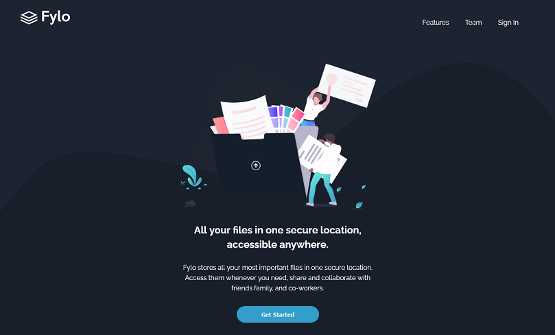

# Frontend Mentor - Fylo dark theme landing page solution

This is a solution to the [Fylo dark theme landing page challenge on Frontend Mentor](https://www.frontendmentor.io/challenges/fylo-dark-theme-landing-page-5ca5f2d21e82137ec91a50fd). Frontend Mentor challenges help you improve your coding skills by building realistic projects. 

### The challenge

Users should be able to:

- View the optimal layout for the site depending on their device's screen size
- See hover states for all interactive elements on the page


### Screenshot




### Built with

- Semantic HTML5 markup
- CSS custom properties
- Flexbox

### What I learned

- How to override default text-decoration for text elements with phone numbers. 
- How to implement cross-browser smooth-scrolling.

```css
a[href^="tel"]{
  color:inherit;
  text-decoration:none;
}
```

### Useful resources

- [Stackoverflow](https://stackoverflow.com/questions/3736807/how-do-i-remove-the-blue-styling-of-telephone-numbers-on-iphone-ios) - This helped me with removing text-decoration from phone numbers when viwed in Safari.
- [W3schools](https://www.w3schools.com/howto/howto_css_smooth_scroll.asp#section1) - This helped me with correctly implementing Smooth Scroll.
